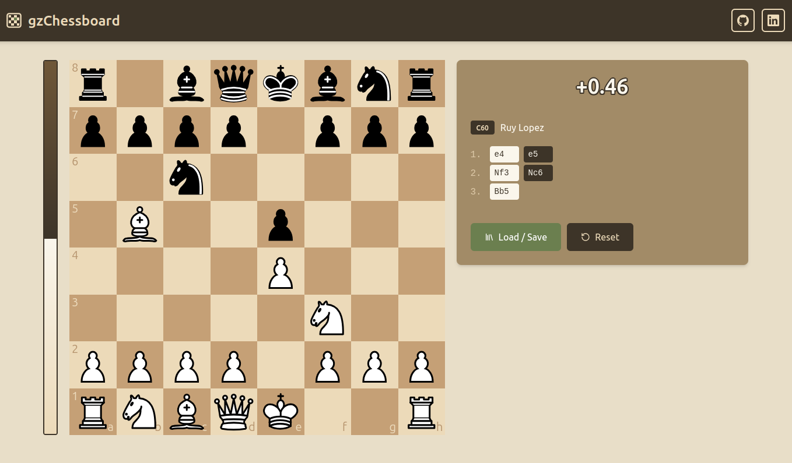

# gzChessboard
A chess analysis board. Just a personal full-stack project built in Angular and Java Spring.

## Features
- Position evaluation with Stockfish service
- Opening detection using ECO codes
- Save and load games as PGN

## How to run
~~~bash
./run.sh    # docker compose up --build
~~~

Then go to [localhost:4200](http://localhost:4200).

Running without Docker

\\
Needs Java 25, Node 22 and Stockfish (`sudo apt install stockfish`).

- Backend:
~~~bash
cd backend
./mvnw spring-boot:run
~~~

- Frontend:
~~~bash
cd frontend
npx ng serve
~~~

API docs (Swagger UI) on [localhost:8080/swagger-ui](http://localhost:8080/swagger-ui/index.html).

## Credits

Board UI is [cm-chessboard](https://shaack.com/projekte/cm-chessboard/), game logic is [chess.js](https://github.com/jhlywa/chess.js/).\
[Opening data](https://github.com/lichess-org/chess-openings) and [sounds](https://github.com/lichess-org/lila/tree/master/public/sound) from Lichess.
